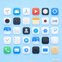

# MakeAppIcon

<div align="center">
    
    <h3>一键生成所有 Apple 平台的 App Icon</h3>
    <p>支持 iOS、macOS、watchOS、tvOS</p>
</div>

---

## 📖 简介

MakeAppIcon 是一款 macOS 应用，帮助开发者快速生成符合 Apple 设计规范的应用图标。只需上传一张高分辨率图片，即可自动生成所有所需的尺寸，大大提升开发效率。

## ✨ 特性

- 🎯 **多平台支持**: 一键生成 iOS、macOS、watchOS、tvOS 所有尺寸的 App Icon
- 🖼️ **智能验证**: 自动检测图片尺寸和比例，确保符合要求
- 🎨 **网格预览**: 直观的网格布局展示所有生成的图标
- 💾 **一键保存**: 批量导出所有图标，自动按平台分类
- ⚡ **高性能**: 使用 Swift Concurrency 异步处理，响应迅速
- 🎭 **保持透明度**: 完整保留原图的透明通道

## 📋 系统要求

- macOS 26.2 或更高版本
- Apple Silicon 或 Intel 处理器

## ⚠️ 重要说明

### 当前版本配置

**开发版本** - 已禁用 App Sandbox
- ✅ 无权限限制
- ✅ 可保存到任何位置
- ✅ 拖拽功能完全正常
- ℹ️ 适合开发测试使用

**发布到 App Store** 需要启用 App Sandbox，详见 `docs/SANDBOX_CONFIG.md`

## 🚀 快速开始

### 1. 准备图片
准备一张符合以下要求的图片：
- 尺寸: 1024x1024、2048x2048 或任意 1:1 比例的正方形
- 格式: PNG、JPG、JPEG、HEIC
- 建议: 使用 2048x2048 或更高分辨率以获得最佳效果

### 2. 上传图片
- **拖拽上传**: 直接拖拽图片到应用窗口
- **点击选择**: 点击上传区域选择图片文件

### 3. 选择平台
在顶部选择需要生成图标的平台：
- iOS (iPhone + iPad)
- macOS
- watchOS
- tvOS

### 4. 预览与保存
- 在预览区域查看所有生成的图标
- 点击右上角"保存全部"按钮
- 选择保存位置，应用会自动创建文件夹结构

## 📁 生成的文件结构

```
AppIcon/
├── iOS/
│   ├── AppIcon-20.png
│   ├── AppIcon-29.png
│   ├── AppIcon-40.png
│   ├── AppIcon-58.png
│   ├── AppIcon-60.png
│   ├── AppIcon-76.png
│   ├── AppIcon-80.png
│   ├── AppIcon-87.png
│   ├── AppIcon-120.png
│   ├── AppIcon-152.png
│   ├── AppIcon-167.png
│   ├── AppIcon-180.png
│   └── AppIcon-1024.png
├── macOS/
│   ├── AppIcon-16.png
│   ├── AppIcon-32.png
│   ├── AppIcon-64.png
│   ├── AppIcon-128.png
│   ├── AppIcon-256.png
│   ├── AppIcon-512.png
│   └── AppIcon-1024.png
├── watchOS/
│   ├── AppIcon-48.png
│   ├── AppIcon-55.png
│   ├── AppIcon-58.png
│   ├── AppIcon-66.png
│   ├── AppIcon-80.png
│   ├── AppIcon-87.png
│   ├── AppIcon-88.png
│   ├── AppIcon-92.png
│   ├── AppIcon-100.png
│   ├── AppIcon-102.png
│   ├── AppIcon-108.png
│   ├── AppIcon-172.png
│   ├── AppIcon-196.png
│   ├── AppIcon-216.png
│   ├── AppIcon-234.png
│   ├── AppIcon-258.png
│   └── AppIcon-1024.png
└── tvOS/
    ├── AppIcon-400x240.png
    ├── AppIcon-800x480.png
    ├── AppIcon-1280x768.png
    ├── AppIcon-1920x720.png
    ├── AppIcon-2320x720.png
    └── AppIcon-4640x1440.png
```

## 📊 支持的图标尺寸

### iOS (iPhone + iPad)
- 20x20, 29x29, 40x40, 58x58, 60x60
- 76x76, 80x80, 87x87, 120x120
- 152x152, 167x167, 180x180, 1024x1024

### macOS
- 16x16, 32x32, 64x64
- 128x128, 256x256, 512x512, 1024x1024

### watchOS
- 主屏幕: 80x80, 88x88, 92x92, 100x100, 102x102, 108x108
- 通知中心: 48x48, 55x55, 58x58, 66x66
- 短暂查看: 172x172, 196x196, 216x216, 234x234, 258x258
- App Store: 1024x1024

### tvOS
- 主屏幕: 400x240, 800x480, 1280x768
- Top Shelf: 1920x720, 2320x720, 4640x1440

## 🛠️ 技术栈

- **开发语言**: Swift 5.0+
- **UI 框架**: SwiftUI
- **图片处理**: Core Graphics
- **异步处理**: Swift Concurrency
- **最低支持**: macOS 26.2

## 📚 文档

- [需求文档](docs/REQUIREMENTS.md) - 详细的功能需求和尺寸规范
- [技术设计](docs/TECHNICAL_DESIGN.md) - 系统架构和实现方案

## 🤝 使用场景

- ✅ iOS/macOS/watchOS/tvOS 开发者
- ✅ UI/UX 设计师
- ✅ 快速原型开发
- ✅ App Icon 资产管理

## ⚠️ 注意事项

1. **图片质量**: 建议使用 2048x2048 或更高分辨率，以保证小尺寸图标的清晰度
2. **透明度**: 应用会保留原图的透明通道，确保你的图片格式支持透明度（如 PNG）
3. **圆角**: iOS/macOS/watchOS 会自动添加圆角，设计时无需手动添加
4. **tvOS**: tvOS 支持 Layered Icons（分层图标）用于视差效果，本应用仅生成静态图标

## 📝 版本历史

### v1.0.0 (2026-04-08)
- ✨ 首次发布
- ✅ 支持 iOS、macOS、watchOS、tvOS
- ✅ 智能图片验证
- ✅ 网格预览
- ✅ 一键保存

## 📄 许可证

本项目采用 MIT 许可证 - 详见 [LICENSE](LICENSE) 文件

## 🙏 致谢

- 感谢 Apple 提供优秀的开发工具和框架
- 图标尺寸规范参考自 [Apple Human Interface Guidelines](https://developer.apple.com/design/human-interface-guidelines/)

---

<div align="center">
    <p>Made with ❤️ by Your Name</p>
</div>
